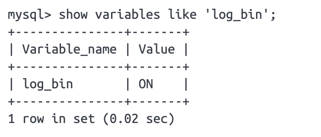
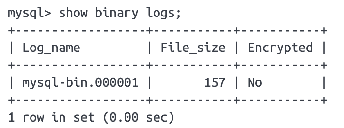

# Event-Sys
事件化系统

# MySQL配置
1、修改mysql配置

2、改了配置文件之后，重启MySQL，使用命令查看是否打开binlog模式：
```
show variables like 'log_bin';
```


3、查看binlog日志文件列表：
```
show binary logs;
```


4、查看当前正在写入的binlog
```
show master status;
```


# 安装canal
1、下载canal（https://github.com/alibaba/canal/releases）：
```
canal.deployer-1.1.7-SNAPSHOT.tar.gz
```

2、修改instance实例配置文件conf/example/instance.properties：
```
# 数据库地址
canal.instance.master.address=127.0.0.1:3306
# binlog日志名称
canal.instance.master.journal.name=mysql-bin.000001
# mysql主库链接时起始的binlog偏移量
canal.instance.master.position=154
# mysql主库链接时起始的binlog的时间戳
canal.instance.master.timestamp=
canal.instance.master.gtid=

# username/password
# 在MySQL服务器授权的账号密码
canal.instance.dbUsername=canal
canal.instance.dbPassword=Canal@123456
# 字符集
canal.instance.connectionCharset = UTF-8
# enable druid Decrypt database password
canal.instance.enableDruid=false

# table regex .*\\..*表示监听所有表 也可以写具体的表名，用，隔开
canal.instance.filter.regex=.*\\..*
# mysql 数据解析表的黑名单，多个表用，隔开
canal.instance.filter.black.regex=
```

3、canal.properties配置相关
```
vim conf/canal.properties
```

4、启动canal server

（1）启动canal
```
sh bin/startup.sh
```
（2）查看日志
```
# canal查看日志
tail -f -n200 logs/canal/canal.log
# 如果canal启动失败则需要查看此日志
tail -f -n200 logs/canal/canal_stdout.log

# 查看instance日志,由上面的配置可知，我们的instance的名字是customer,所以看这个日志. 
tail -f -n200 logs/customer/customer.log
```

# 遇到的问题
1、启动canal报错：
```
Unrecognized VM option 'AggressiveOpts'
Error: Could not create the Java Virtual Machine.
Error: A fatal exception has occurred. Program will exit.
```
问题原因：jdk版本不兼容，更换jdk版本为8（我当前的jdk版本为17）
```
brew uninstall openjdk@17
brew install openjdk@8
```


# 参考文章
- https://juejin.cn/post/6969089160858566693
- https://developer.aliyun.com/article/770496
- https://mynamelancelot.github.io/tool/canal.html
  